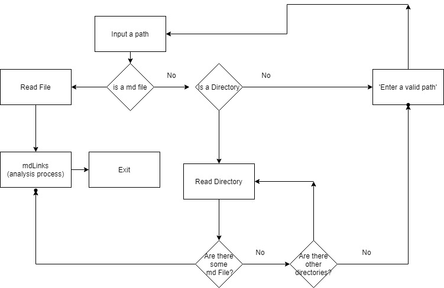
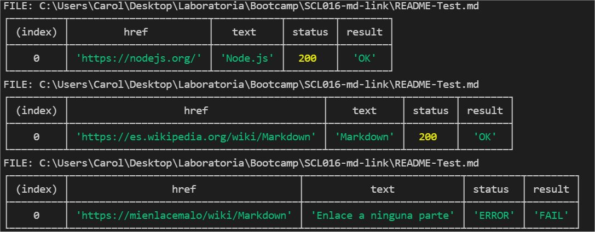
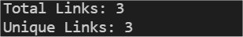
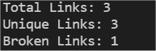

# Markdown Links Project - Revisa enlaces de archivos md

## 1. Introducción

[Markdown](https://es.wikipedia.org/wiki/Markdown) es un lenguaje de marcado
ligero muy popular entre developers. Es usado en muchísimas plataformas que
manejan texto plano (GitHub, foros, blogs, ...), y es muy común
encontrar varios archivos en ese formato en cualquier tipo de repositorio
(empezando por el tradicional `README.md`).

Estos archivos `Markdown` normalmente contienen _links_ (vínculos/ligas) que
muchas veces están rotos o ya no son válidos y eso perjudica mucho el valor de
la información que se quiere compartir.

Se nos ha requerido crear una herramienta que permita leer, analizar y entregar respuesta sobre el estado de dichos enlaces.

## 2. Notas de Desarrollo

Para dar respuesta a los requerimientos, discriminamos como parametros de entrada la ruta a analizar y luego, dependiendo si es archivo o directorio, resolvemos la existencia de ficheros md y realizamos su analisis, en un flujo que es de la siguiente manera.

### Dependencias
* "filehound": "^1.17.4",
* "marked": "^2.0.3",
* "node-fetch": "^2.6.1"

# Guía de Uso

Para hacer uso de esta librería, puedes instalarla desde: 

    npm install --global https://github.com/CarolAbcl/SCL016-md-link

Esta aplicación se ejecuta de la siguiente manera a través de la terminal:

    mdLinks <path-to-file> [options]

## Options

### --validate 
El modulo realiza una petición HTTP para averiguar si el enlace funciona entregando como respuesta un OK si esta correcto o FAIL si es fallido.

### -- stats
Si pasamos esta opción, se nos entrega un texto con estadisticas básicas sobre los enlaces.

### --validate --stats
Realiza una combinación de los dos anteriores entregando estadisticas y numero de enlaces fallidos.

 
 
 
Si pasas mdLinks sin opciones por defecto entrega una lista de los enlaces encontrados.

